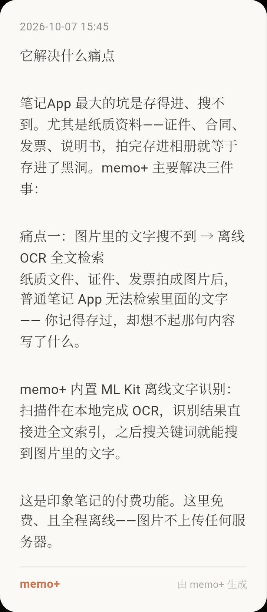
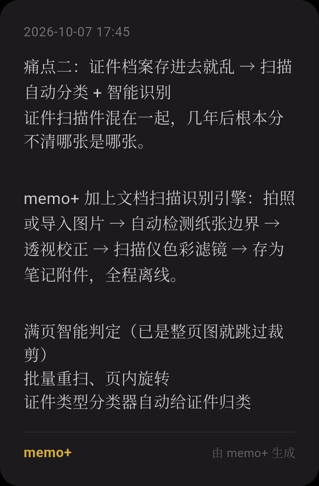
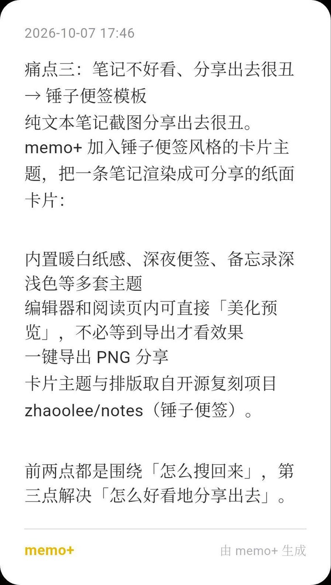

# memo+

> **A local-first, privacy-focused note & document scanner for Android.**
> Capture thoughts like flowing cards, scan paper and IDs with on-device OCR, and find any word inside any image — all offline, no account, no telemetry.

memo+ is an open-source Android app that combines three proven open-source building blocks into one privacy-first tool. It is derived from **[MemoFlow](https://github.com/hzc073/memoflow)** (GPL-3.0) and adds offline document scanning and beautiful, shareable card themes.

  
  
  

Three pain points, three real cards · card theme inspired by Smartisan Notes (design from <a href="https://github.com/zhaoolee/notes">zhaoolee/notes</a>)

---

## Why memo+

The biggest trap with note apps is **you can store it, but you can't find it again** — especially paper: IDs, contracts, receipts, manuals. You photograph them, they vanish into a black hole. memo+ fixes three things:

### 1. Words trapped inside images → offline OCR full-text search
A receipt or ID saved as a photo is invisible to search in most note apps. memo+ runs **ML Kit on-device OCR**: scans are recognized locally and **the text goes straight into a full-text index**, so a keyword finds the sentence inside the picture.

> This is a *paid* feature in Evernote. Here it's free and **100% offline** — images never leave your device.

### 2. Scanned documents turn into a mess → a real scan engine
Photographs or imported images go through a document-scanning pipeline adapted from **OpenScan**: auto edge detection → perspective correction → scanner color filters → saved as a note attachment, **entirely offline**.

- Full-page detection (skips cropping when the image is already a clean page)
- Batch re-scan and in-page rotation
- Rotation takes effect instantly (reloaded via a fresh widget key)

### 3. Notes look ugly when shared → elegant shareable cards
Plain-text screenshots look cheap. memo+ renders a note as a **themed, shareable paper card** inspired by Smartisan Notes:

- Multiple built-in themes (warm paper, night memo, light/dark memo…)
- **Beautify preview inside the editor and reader** — no need to export to see the result
- One-tap PNG export to share

> Card theme & layout are adapted from the open-source reimplementation **[zhaoolee/notes](https://github.com/zhaoolee/notes)** (Smartisan Notes).

---

## Features

- 🛡️ **Privacy-first & fully offline** — no account, no telemetry. Everything (OCR, indexing, scanning) happens on your device.
- 🔍 **Offline OCR full-text search** — find any text inside any scanned image, no cloud needed.
- 📸 **Document & ID scanner** — edge detection, perspective correction, color filters, batch re-scan, in-page rotation.
- 🏷️ **Automatic document-type tagging** — each scan is recognized by type (ID card, passport, driver licence, business licence, invoice, receipt, bank card…) and tagged automatically using **offline OCR-text rules** (checksums, credit-code patterns, machine-readable zones). No cloud needed; find every licence by its type tag.
- 🎨 **Beautiful shareable cards** — themed paper cards with one-tap PNG export.
- ☁️ **You control your sync** — optional sync to a **self-hosted Memos server** you run, or **encrypted WebDAV backup**. Nothing is sent to us.
- 🌐 **7 languages** — 简体中文, 繁體中文, English, 日本語, 한국어, Deutsch, Português.
- 🌗 **Light & dark themes.**
- 💻 **Flutter / Dart** — modern, cross-platform codebase (Android is the released target; desktop builds live in source).

## Privacy & offline

memo+ is built around *local-first*:

- No account, no sign-up, no analytics, no network calls unless you explicitly enable sync/backup.
- All OCR and indexing run on-device via ML Kit.
- Sync/backup, if enabled, goes only to infrastructure **you** provide (your Memos server or your WebDAV). There is no memo+ cloud.

## Download & update

Get the latest APK (Android, arm64) from the [Releases](../../releases) page.

Inside the app, **Settings → About → Check for updates** reads `latest.json` from this repo's Releases and prompts you when a new version is available. To publish, upload `latest.json` (plus its per-language copies `latest.<locale>.json`) together with the APK as Release assets; `releases/latest/download/` always points to the newest version.

## Built on open source

| Project | License | What it contributes |
| --- | --- | --- |
| [MemoFlow](https://github.com/hzc073/memoflow) | GPL-3.0 | **App foundation**: capture, tags, collections, review — memo+ is a derivative work |
| [OpenScan](https://github.com/ethereal-developers/OpenScan) | BSD-3-Clause | **Document scanning**: edge detection / perspective correction / color filters |
| [zhaoolee/notes](https://github.com/zhaoolee/notes) | Apache-2.0 | **Card theme & layout** (Smartisan Notes) |
| Google **ML Kit** | — | On-device OCR |

Full third-party component list (libcaesium, image_gallery_saver, phosphor_flutter, Readability.js, …) is in [THIRD_PARTY_NOTICES.md](./THIRD_PARTY_NOTICES.md).

## Roadmap

- [ ] Broader document-type coverage and finer sub-categories (the offline classifier already tags 15 common types)
- [ ] Broader offline OCR language models (balanced against app size)
- [ ] F-Droid build
- [ ] Polished desktop (Windows / macOS / Linux) releases

## License

memo+ is a derivative of MemoFlow and is released under **GPL-3.0**. See [LICENSE](./LICENSE).

Redistribution must follow GPL-3.0: keep upstream copyright notices, mark your modifications, and provide corresponding source. This repository *is* the corresponding source.

---

## 简体中文

memo+ 是一款**本地优先、隐私优先**的安卓笔记客户端，把三个开源项目缝合成一个工具：基于 [MemoFlow](https://github.com/hzc073/memoflow)（GPL-3.0）的笔记基底，加入离线文档扫描与锤子便签风格的卡片主题。

**它解决什么**：笔记 App 最大的坑是「存得进、搜不到」，尤其纸质资料（证件、合同、发票、说明书）拍完就进了黑洞。

- **图片里的文字搜不到 → 离线 OCR 全文检索**：内置 ML Kit 离线识别，扫描件文字直接进入全文索引，搜关键词即可命中图片内文字（印象笔记的付费功能，这里免费且全程离线）。
- **证件档案存进去就乱 → 真实扫描引擎**（改编自 OpenScan）：自动边界检测、透视校正、扫描仪滤镜、满页智能判定、批量重扫、页内旋转，全程离线。
- **分不清是什么 → 离线自动分类打标签**：扫描件按 OCR 文本结构（身份证号 GB11643 校验和、统一社会信用代码、护照机读区等）自动识别为 15 类常见证件票据（身份证、护照、驾照、营业执照、发票、收据、银行卡…），并打上对应短标签，按类型即可检索。全程离线，无需联网。
- **笔记不好看、分享很丑 → 锤子便签风格卡片**：多套主题（暖白纸感、深夜便签、深浅色），编辑器/阅读页内可直接「美化预览」，一键导出 PNG。

**隐私与离线**：无账号、无遥测；OCR、索引、扫描全部在本机完成。同步/备份（可选）只连你自己的基础设施——自建 Memos 服务器或加密 WebDAV，没有 memo+ 云端。

**下载**：[Releases](../../releases) 页面获取最新 APK（Android，arm64）。应用内「设置 → 关于 → 检查更新」会读取本仓库 Releases 的 `latest.json` 提示新版本。

**许可证**：基于 MemoFlow 衍生，依 GPL-3.0 发布。分发须保留上游版权、标明修改并提供对应源码（本仓库即对应源码）。
