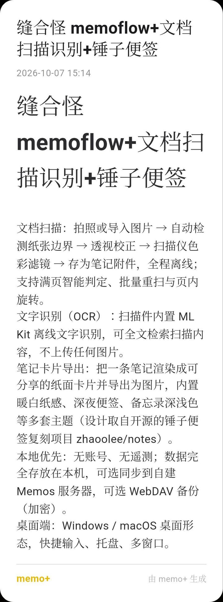
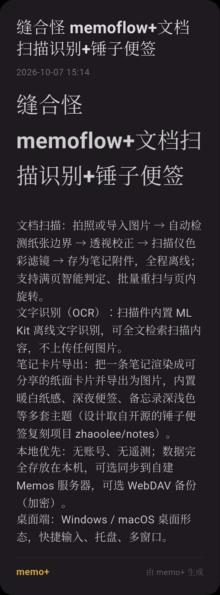
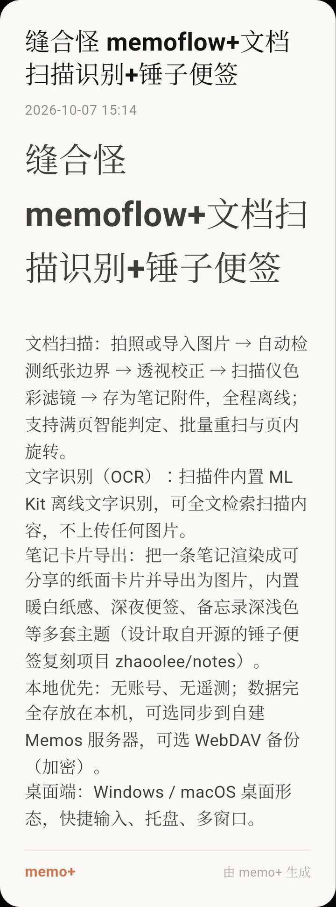

# memo+

> **缝合怪** —— [MemoFlow](https://github.com/hzc073/memoflow) ＋ 文档扫描识别 ＋ 锤子便签模板
>
> 三个开源项目缝在一起，专治一件事：**笔记存进去之后，找不回来。**

memo+ 是一款本地优先的笔记客户端，基于开源项目 [MemoFlow](https://github.com/hzc073/memoflow)（GPL-3.0）深度改进而来，兼容 [Memos](https://github.com/usememos/memos) 服务器协议。

  
  
  

同一条笔记 · 三套卡片主题 · 锤子便签风格（设计取自 <a href="https://github.com/zhaoolee/notes">zhaoolee/notes</a>）

---

## 它解决什么痛点

笔记App 最大的坑是**存得进、搜不到**。尤其是纸质资料——证件、合同、发票、说明书，拍完存进相册就等于存进了黑洞。memo+ 主要解决三件事：

### 痛点一：图片里的文字搜不到 → 离线 OCR 全文检索

纸质文件、证件、发票拍成图片后，普通笔记 App 无法检索里面的文字 —— 你记得存过，却想不起那句内容写了什么。

memo+ 内置 **ML Kit 离线文字识别**：扫描件在本地完成 OCR，**识别结果直接进全文索引**，之后搜关键词就能搜到图片里的文字。

> 这是印象笔记的**付费功能**。这里免费、且**全程离线**——图片不上传任何服务器。

### 痛点二：证件档案存进去就乱 → 扫描自动分类 + 智能识别

证件扫描件混在一起，几年后根本分不清哪张是哪张。

memo+ 加上**文档扫描识别**引擎：拍照或导入图片 → 自动检测纸张边界 → 透视校正 → 扫描仪色彩滤镜 → 存为笔记附件，**全程离线**。

- 满页智能判定（已是整页图就跳过裁剪）
- 批量重扫、页内旋转
- 证件类型分类器自动给证件归类

### 痛点三：笔记不好看、分享出去很丑 → 锤子便签模板

纯文本笔记截图分享出去很丑。memo+ 加入**锤子便签风格**的卡片主题，把一条笔记渲染成可分享的纸面卡片：

- 内置暖白纸感、深夜便签、备忘录深浅色等多套主题
- **编辑器和阅读页内可直接「美化预览」**，不必等到导出才看效果
- 一键导出 PNG 分享

> 卡片主题与排版取自开源复刻项目 [zhaoolee/notes](https://github.com/zhaoolee/notes)（锤子便签）。

**前两点都是围绕「怎么搜回来」，第三点解决「怎么好看地分享出去」。**

---

## 缝合怪的三个来源

| 项目 | 许可证 | 缝进来做什么 |
| --- | --- | --- |
| [MemoFlow](https://github.com/hzc073/memoflow) | GPL-3.0 | **应用基底**：记录、标签、集合、回顾，memo+ 是其衍生作品 |
| [OpenScan](https://github.com/ethereal-developers/OpenScan) | BSD-3-Clause | **文档扫描识别**：边界检测 / 透视校正 / 色彩滤镜 |
| [zhaoolee/notes](https://github.com/zhaoolee/notes) | Apache-2.0 | **锤子便签卡片主题**：排版与视觉模板 |

再加上 Google **ML Kit** 的离线 OCR 能力。

## 其他特性

- **本地优先**：无账号、无遥测；数据完全存放在本机，可选同步到自建 Memos 服务器，可选 WebDAV 备份（加密）。
- **桌面端**：Windows / macOS 桌面形态，快捷输入、托盘、多窗口。

## 下载安装

前往 [Releases](../../releases) 页面下载最新的 APK（Android，arm64）安装。

应用内「设置 → 关于 → 检查更新」会从本仓库的 Releases 读取 `latest.json` 提示新版本。发布新版本时，把 `latest.json`（含各语言副本 `latest.<locale>.json`）与 APK 一起作为 Release 附件上传即可，`releases/latest/download/` 地址永远指向最新一版。

## 版权与致谢

完整第三方组件清单（含 libcaesium、image_gallery_saver、phosphor_flutter、Readability.js 等）见 [THIRD_PARTY_NOTICES.md](./THIRD_PARTY_NOTICES.md)。

## 许可证

本项目基于 MemoFlow 衍生，依 GPL-3.0 以同许可证发布。完整许可证文本见 [LICENSE](./LICENSE)。

分发本软件时须遵守 GPL-3.0：保留上游版权声明、标明修改、并提供对应源码。本仓库即对应源码。